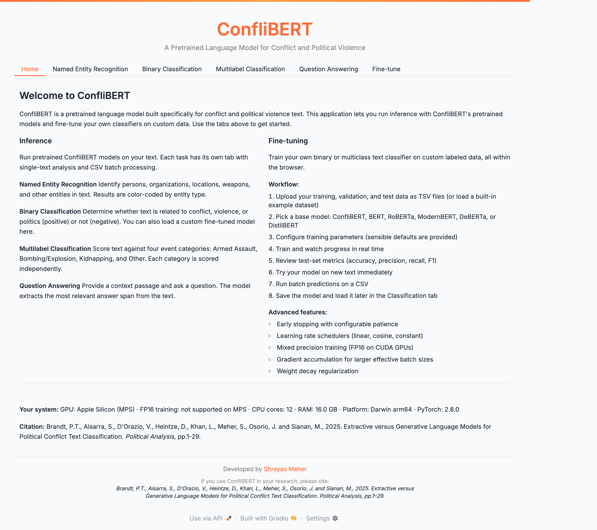
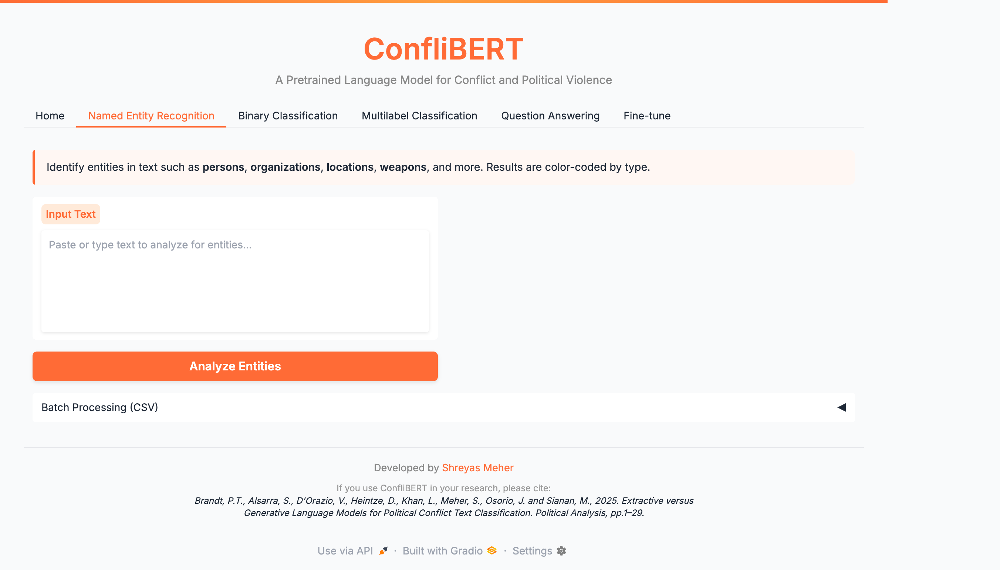
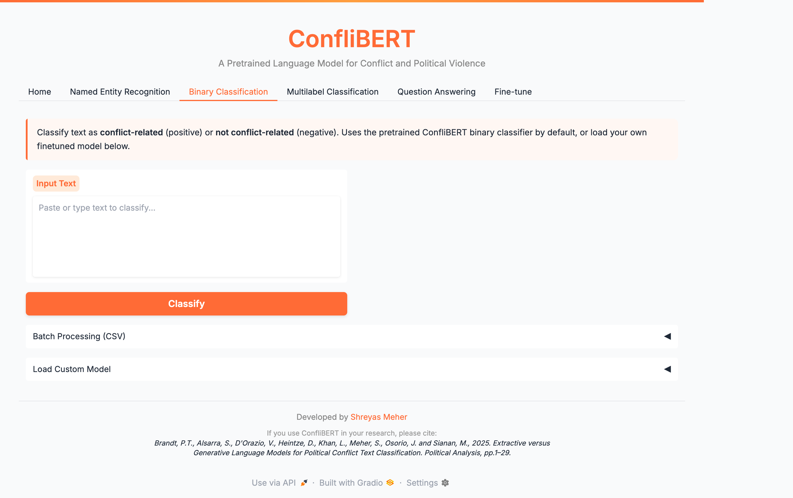
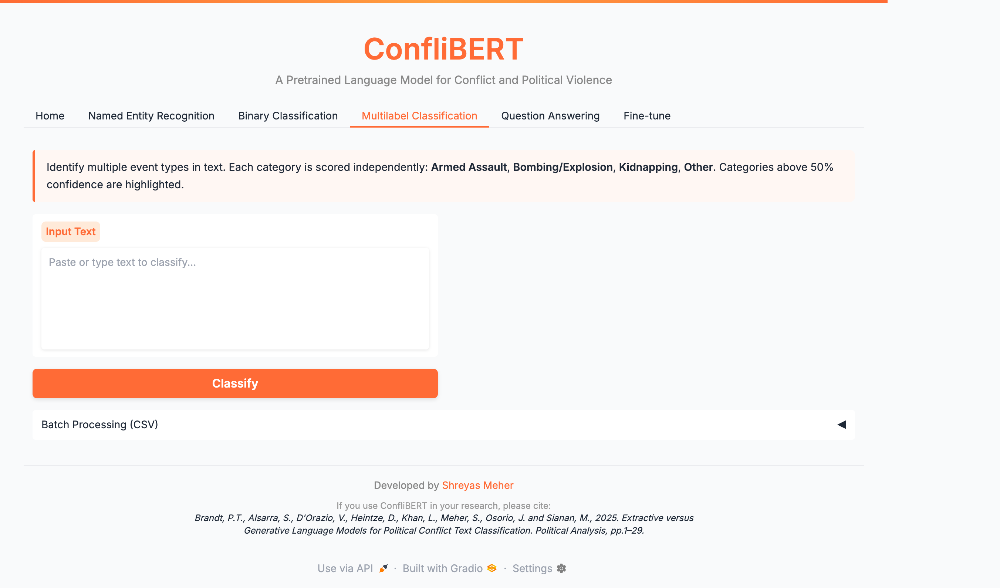
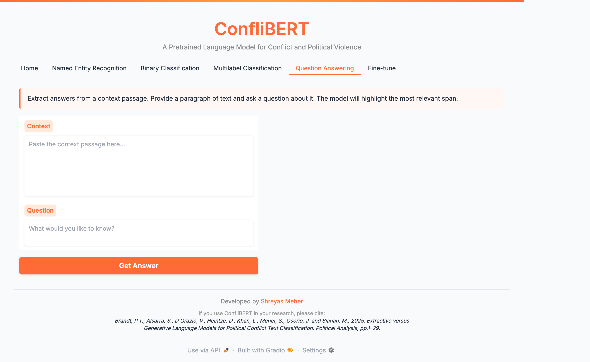
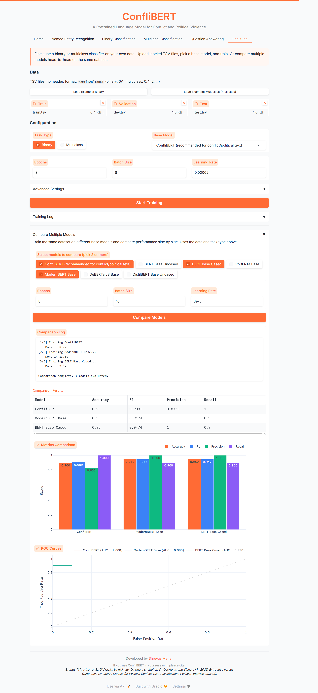

A browser-based NLP toolkit for conflict and political violence text analysis. Built on [ConfliBERT](https://eventdata.utdallas.edu/conflibert/), the GUI provides an accessible interface for named entity recognition, text classification, question answering, and model fine-tuning --- no coding required.

[GitHub](https://github.com/shreyasmeher/ConfliBERT-gui){target="_blank"} | Developed with [Sultan Alsarra](https://www.linkedin.com/in/sultan-alsarra-phd-56977a63/)

## Features

- **Named Entity Recognition** --- Identify organizations, persons, locations, weapons, and temporal expressions in conflict text
- **Binary Classification** --- Determine if text describes a conflict event, with confidence scores
- **Multilabel Classification** --- Categorize text into event types: Armed Assault, Bombing/Explosion, Kidnapping, Other
- **Question Answering** --- Extract answers from conflict-related passages
- **Fine-Tuning** --- Train custom classifiers with LoRA/QLoRA on your own data, with seven base architectures
- **Batch Processing** --- Upload CSVs for bulk analysis

## Walkthrough

### Home

The landing page lets you select your task and input text directly or upload a CSV for batch processing.

{.walkthrough-img fig-alt="ConfliBERT GUI home screen"}

### Named Entity Recognition

Paste any conflict-related text and the model identifies and color-codes named entities --- persons, organizations, locations, weapons, and more.

{.walkthrough-img fig-alt="NER results with color-coded entities"}

### Text Classification

Binary classification determines whether text describes a conflict event. Results include confidence scores for each class.

{.walkthrough-img fig-alt="Binary classification results with confidence scores"}

### Multilabel Classification

Each text is scored against four event categories independently, useful for texts describing multiple event types.

{.walkthrough-img fig-alt="Multilabel classification showing multiple event type scores"}

### Question Answering

Enter a passage and a question. The model extracts the relevant answer span directly from the text.

{.walkthrough-img fig-alt="Question answering extracting answers from context"}

### Fine-Tuning

Train custom classifiers on your labeled data. Select a base model, upload training/validation sets, configure hyperparameters, and monitor training progress.

{.walkthrough-img fig-alt="Fine-tuning interface with model selection and training parameters"}

## Installation

```bash
# Clone the repository
git clone https://github.com/shreyasmeher/conflibert-gui.git
cd conflibert-gui

# Create virtual environment
python -m venv env
source env/bin/activate  # Mac/Linux
# env\Scripts\activate   # Windows

# Install dependencies
pip install -r requirements.txt

# Run
python app.py
# Open http://localhost:7860
```

**Requirements:** Python 3.8+, PyTorch, Transformers, Gradio

## Models

| Task | Model |
|------|-------|
| NER | `eventdata-utd/conflibert-named-entity-recognition` |
| Binary Classification | `eventdata-utd/conflibert-binary-classification` |
| Multilabel | `eventdata-utd/conflibert-satp-relevant-multilabel` |
| Question Answering | `salsarra/ConfliBERT-QA` |

## Citation

```bibtex
@inproceedings{hu2022conflibert,
  title={ConfliBERT: A Pre-trained Language Model for Political Conflict and Violence},
  author={Hu, Yibo and Hosseini, MohammadSaleh and Parolin, Erick Skorupa
          and Osorio, Javier and Khan, Latifur and Brandt, Patrick and D'Orazio, Vito},
  booktitle={Proceedings of NAACL-HLT 2022},
  pages={5469--5482},
  year={2022}
}
```
