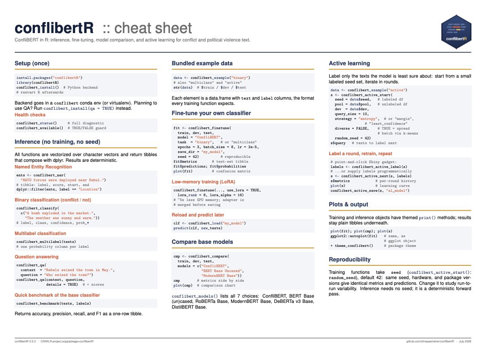

::: {.pkg-hero}
::: {.pkg-hero-text}
# conflibertR

[Political conflict text analysis in R, powered by ConfliBERT.]{.pkg-lede}

::: {.pkg-badges}
{fig-alt="CRAN status badge"}
{fig-alt="R-CMD-check status badge"}
:::

::: {.pkg-links}
[CRAN](https://CRAN.R-project.org/package=conflibertR)
[GitHub](https://github.com/shreyasmeher/conflibertR)
[Cheatsheet](conflibertR-cheatsheet.pdf)
[Report a bug](https://github.com/shreyasmeher/conflibertR/issues)
:::
:::
::: {.pkg-hex}
{fig-alt="conflibertR hex logo"}
:::
:::

[ConfliBERT](https://eventdata.utdallas.edu/) is an NSF-funded language model
pretrained on a large corpus of politics, conflict, and violence text, and it
consistently beats general-purpose LLMs on conflict-event tasks while running
hundreds of times faster ([Hu et al. 2022](https://doi.org/10.18653/v1/2022.naacl-main.400);
[Brandt et al. 2025](https://doi.org/10.1017/pan.2025.10027)). conflibertR
wraps the full ConfliBERT workflow in idiomatic R: every function takes and
returns plain data frames, so results drop straight into a dplyr or ggplot2
pipeline, with no Python visible at any point.

## What it does

::: {.pkg-grid}
::: {.pkg-cell}
#### Inference out of the box
Named entity recognition, binary and multilabel event classification, and
question answering with the published ConfliBERT checkpoints. Vectorized,
deterministic, and tibble-in, tibble-out.
:::
::: {.pkg-cell}
#### Fine-tuning
Train a classifier on your own labeled data with `conflibert_finetune()`,
choosing among 7 base models. LoRA support cuts GPU memory roughly 5x, and
seeded training makes runs exactly reproducible.
:::
::: {.pkg-cell}
#### Model comparison
`conflibert_compare()` fine-tunes several base models on the same split and
reports test metrics side by side, so the "which encoder should I use?"
question is one function call.
:::
::: {.pkg-cell}
#### Active learning
Label only the documents the model is least certain about.
`conflibert_active_start()` manages the loop, with a point-and-click Shiny
gadget for labeling and diversity-aware batch selection.
:::
:::

## Installation

```r
install.packages("conflibertR")

library(conflibertR)
conflibert_install()   # one-time Python backend setup, then restart R
```

The package is a [reticulate](https://rstudio.github.io/reticulate/) wrapper:
`conflibert_install()` provisions a conda or virtualenv environment with
PyTorch and transformers once, and everything after that is plain R.

## A quick look

::: {.panel-tabset}

### Inference

```r
conflibert_ner("NATO forces were deployed near Kabul in September.")
#> ── ConfliBERT entities ────────── 3 entities in 1 text ──
#>   1. NATO forces were deployed near Kabul in September.
#>      Organisation   NATO       0.99
#>      Location       Kabul      0.99
#>      Temporal       September  0.98

conflibert_classify("A bomb exploded in the crowded market.")
#> # A tibble: 1 × 6
#>   text                    label    class confidence ...
#> 1 A bomb exploded in the… Positive     1      0.98
```

### Fine-tuning

```r
data <- conflibert_example("binary")

fit <- conflibert_finetune(
  data$train, data$dev, data$test,
  model = "ConfliBERT", epochs = 3, seed = 42
)
fit$metrics    # accuracy, precision, recall, F1
plot(fit)      # test-set confusion matrix
```

### Active learning

```r
data <- conflibert_example("active")

s <- conflibert_active_start(
  seed = data$seed, pool = data$pool,
  dev = data$dev, query_size = 10
)
labels <- conflibert_active_label(s)  # Shiny labeling gadget
s <- conflibert_active_next(s, labels)
plot(s)                               # learning curve by round
```

:::

## Cheatsheet

::: {.pkg-cheatsheet}
::: {.pkg-cheatsheet-thumb}
[{fig-alt="Preview of the conflibertR cheatsheet"}](conflibertR-cheatsheet.pdf)
:::
::: {.pkg-cheatsheet-text}
The whole package on one page: setup, the four inference functions,
fine-tuning and LoRA, model comparison, and the active-learning loop.

[Download the cheatsheet (PDF)](conflibertR-cheatsheet.pdf)
:::
:::

## Citing

If you use conflibertR in published work, please cite the ConfliBERT model
paper; `citation("conflibertR")` has the full details.

```bibtex
@inproceedings{hu2022conflibert,
  title     = {{ConfliBERT}: A Pre-trained Language Model for
               Political Conflict and Violence},
  author    = {Hu, Yibo and Hosseini, MohammadSaleh and
               Skorupa Parolin, Erick and Osorio, Javier and
               Khan, Latifur and Brandt, Patrick and D'Orazio, Vito},
  booktitle = {Proceedings of NAACL-HLT 2022},
  pages     = {5469--5482},
  year      = {2022},
  doi       = {10.18653/v1/2022.naacl-main.400}
}
```
